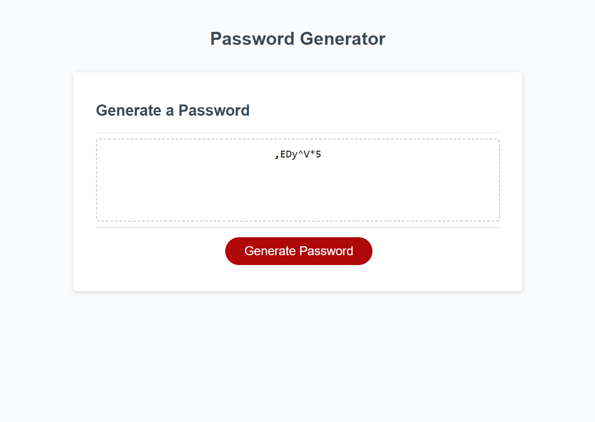

# <Challenge 3: Password Generator>

## Description

- In this project, a fictional company wanted us to create a tool to generate secure passwords for employees.
- We were given starter code for the html and css, and some basic js code; the rest of the js writing was our responsibility.
- To allow users to customize parameters to their needs, we implemented popup boxes asking for desired length and character sets to their password.
- We ensured the generation process would stop if parameters were nonsensical. Accepting only reasonable parameters reduces the risk of bugs.
- Once these parameters were set, the code we wrote randomly generated an array of characters from the selected character sets.
- We included a function to check if the generated array included at least one character from each selected set.
- If it did not, a new array was generated until one met parameters. The successful array was then converted into a string.
- Keeping our variables and code sequence organized allowed us to display the string in the designated box in the browser, as intended.
- This project was an effective exercise in Javascript competency. We were able to especially showcase our code organization and simplicity here.

## Usage

- To use the password generator, first navigate to the webpage. At time of publication, the project can be found deployed at https://dopalescent.github.io/Password-Generator/
- Once there, click the red button reading "Generate Password".
- Several popup windows will appear. The first is a prompt to declare a numeric value between 8 and 128 to set the desired password length. Entering a value outside this range, entering a non-numeric value, or entering no value/closing the popup will result in an alert with an error message. The function will be aborted here, but can be restarted by clicking the generate password button again.
- The following popups will be confirms to opt into uppercase letters, lowercase letters, numbers, and special characters, respectively. Selecting cancel on all four will result in an error message, and the function will be aborted. It can be restarted as stated above.
- Once acceptable parameters have been set, the generated password will be displayed in the box that previously read "Your Secure Password". Clicking the red button again will launch a new series of popups, and any new passwords will replace the previous in the same box.

- The following screenshot previews the deployed project:

## Credits

- Antonio DeLeo and Keller Vicino for their collaborative efforts
- Penn LPS Boot Camp program for education and resources
- MDN Web Docs for their useful references, most notably on instance methods, array methods, and their random number generator
- EdX and The Full-Stack Blog for their 'Professional README Guide' article